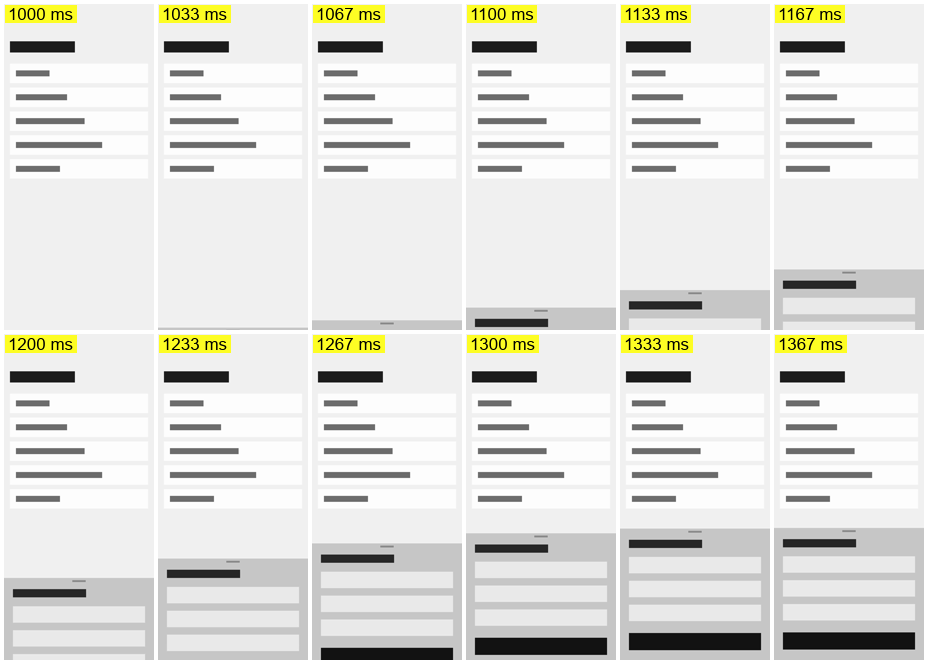
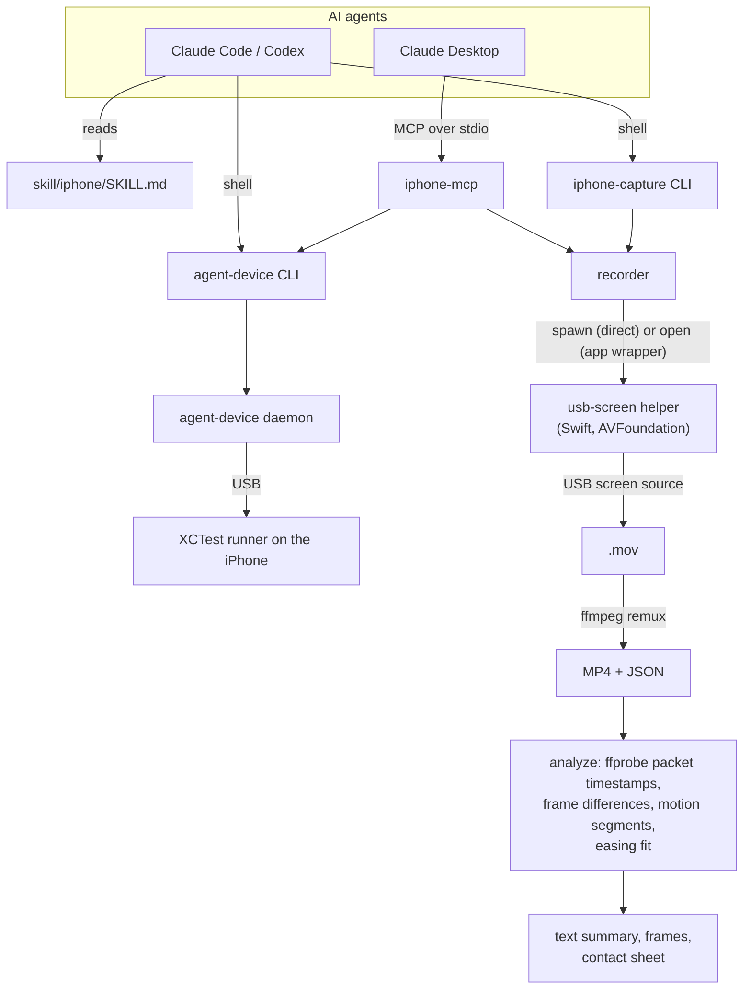

# Agent iPhone Kit

[](https://github.com/gabba6/agent-iphone-kit/actions/workflows/tests.yml)


[](LICENSE)

**Let AI coding agents drive a real iPhone over USB in short, token-efficient steps – and measure UI animations at 60 fps with real device timestamps.**

Coding agents such as Claude Code and Codex can already tap through an iPhone with [agent-device](https://github.com/callstack/agent-device). This kit adds what I was missing for real-device work: measured interaction patterns that keep agents quick and cheap, a native 60 fps screen recorder with motion analysis (durations, easing curves, frames) and a lean MCP server for Claude Desktop. Typical uses:

- **UI exploration** – let an agent walk through an app's screens, menus and settings and document them as text.
- **Testing on real devices** – scripted checks with `wait`/`is`/`get` instead of screenshots.
- **Motion and animation analysis for design and QA** – how long does a transition take, which easing curve does it use, does it overshoot?

## Why

| | agent-device alone | with this kit |
|---|---|---|
| Recording UI motion | `record`: about 7–10 fps, 0.7–1.25 s freeze on every tap | 53–60 fps with device timestamps, durations to 16.7 ms |
| Tap + verify | `press --settle`: 4.1 s, ≈ 650 tokens | `press` + `wait text`: 1.8 s, ≈ 12 tokens |
| MCP tool schema | ≈ 59k tokens (59 tools) | ≈ 1.9k tokens (17 UI and recording tools) |

Measured on one iPhone, see [Measured results](#measured-results). To be fair to agent-device: its `record` is built for overview videos (periodic XCTest screenshots), not for frame timing, and its MCP server covers far more than UI commands and recording.

## What it adds on top of agent-device

| Part | What it does |
|---|---|
| **Agent skill** [`skill/iphone`](skill/iphone/SKILL.md) | Instructions for Claude Code and Codex with patterns measured on a real iPhone (e.g. `press` + `wait text` in 1.8 s instead of 4.1 s with `--settle` for the same selector tap; with a ref or coordinates about 0.9 s in an agent run), multi-agent handover and safety rules. |
| **`iphone-capture`** CLI | Native USB screen recording at up to 60 fps with device timestamps (`agent-device record` delivered about 7–10 fps in my measurements), plus analysis: motion segments, durations, frame-change times, cubic-bezier easing fit with an overshoot (spring) hint, single frames and contact sheets. |
| **`iphone-mcp`** | A lean MCP server for clients without a shell: 17 tools, about 2k tokens of tool schema versus about 59k for agent-device's full MCP server (59 tools; even a 16-tool subset is ≈ 14k). `iphone-mcp` deliberately covers only UI commands and recording. |

agent-device is not part of this repository and is installed separately; this project is not a fork and is not affiliated with Callstack. See [Credits](#credits).

## Example

```sh
# agent-device drives the UI
agent-device open com.apple.Preferences --foreground     # app to the front, returns a snapshot with @refs
agent-device press @e12 && agent-device wait text "About" 3000   # standard step: tap + verify (about 1–1.8 s)

# iphone-capture records and measures; everything after -- is an agent-device command
iphone-capture clip 4 --after 1 -- press 201 300          # record 4 s, tap after 1 s
iphone-capture changes --curve 1                          # motions: start, end, duration, frames, fps + easing fit
iphone-capture frames 2.767 2.85                          # single frames (first frame at or after each time)
iphone-capture sheet --segment 1                          # contact sheet with real ms timestamps
```

For every recording, `changes` lists each motion with start and end time (seconds from the first video frame), duration, number of frames, effective fps and the screen area in points. `--curve N` adds the progress curve of motion N, the best-fitting `cubic-bezier(...)` with its deviation, the estimated duration and whether the motion overshoots (a spring hint).

A prompt to try once everything is set up: *"Open Settings on my iPhone, record the transition into General and tell me its duration and easing."*

## Sample output

You can try the analysis without an iPhone. [`iphone/examples/make-demo-clip.mjs`](iphone/examples/make-demo-clip.mjs) renders a synthetic 3 s screen recording at the iPhone 17 Pro's resolution in which a bottom sheet slides up with a known curve (`cubic-bezier(0.42, 0, 0.58, 1)`, 350 ms) and closes again:

```sh
node iphone/examples/make-demo-clip.mjs /tmp/demo.mp4
export IPHONE_RECORDINGS_DIR="$(mktemp -d)"      # keep the demo apart from real recordings
iphone-capture import /tmp/demo.mp4              # takes any MP4/MOV screen recording
iphone-capture changes --curve 1 --json
```

Shortened output:

```json
{
  "segments": [
    { "n": 1, "start_ms": 1016.7, "end_ms": 1350, "dur_ms": 333.3, "frames": 21, "fps": 60, "box_pt": [0, 520, 402, 876] },
    { "n": 2, "start_ms": 2016.7, "end_ms": 2250, "dur_ms": 233.3, "frames": 15, "fps": 60, "box_pt": [0, 520, 402, 876] }
  ],
  "curve": {
    "n": 1, "mode": "Position", "axis": "y", "travel_pt": -356.3, "overshoot": 0,
    "fit": [
      { "name": "easeInOut (iOS/Flutter/CSS)", "cp": [0.42, 0, 0.58, 1], "rmse": 0.002, "start_ms": -16.7, "dur_ms": 350 },
      { "name": "easeInOutCubic (Flutter)", "cp": [0.645, 0.045, 0.355, 1], "rmse": 0.048, "start_ms": -16.7, "dur_ms": 350 }
    ]
  }
}
```

The analysis finds both motions, recovers the easeInOut curve with an RMS deviation of 0.2 % and the travel within 3 pt (356 of 354 pt). The motion segment spans 333 ms from the first to the last changed frame; the fit places the true start between the last idle frame and the first change and reports the full 350 ms. `iphone-capture sheet --segment 1` turns the same motion into a contact sheet:



[`iphone/test/demo.test.mjs`](iphone/test/demo.test.mjs) runs this example in CI, so these numbers stay reproducible. (`import` currently also expects the built USB helper from step 2 of the quickstart to exist.)

## Architecture



How the analysis works:

- **Timestamps** come from the video packets (`ffprobe`), i.e. the device's own frame times, not a fixed frame grid.
- **Frame changes:** every frame is reduced to a grayscale grid 201 px wide and compared with the previous one; the top 56 pt (status bar, Dynamic Island) are masked. A pause of 300 ms separates two motions.
- **Easing:** for translations the analysis aligns row/column profiles of each frame with the final frame; for fades it uses the image difference. The resulting progress curve is fitted against 11 common curves (CSS ease family, iOS/Flutter easeInOut, easeOutCubic, Material fastOutSlowIn and M3 curves, …) while also estimating the true start between the last idle frame and the first change. Overshoot above 2 % is flagged as a likely spring.

## Measured results

Single device and small samples – see [docs/BENCHMARKS.md](docs/BENCHMARKS.md) for methodology and caveats.

| What | Result |
|---|---|
| Device-tool time per UI step in an agent session (median of 5 steps, excludes the model's thinking time) | **1.17 s** |
| Output per UI step | ≈ **150 tokens** (median 595 characters) |
| `press @ref` / `press <selector>` + `wait text` / `press <selector> --settle` | 1.0 s / **1.8 s** / 4.1 s (n = 10 each) |
| `snapshot -i` | 0.46 s, ≈ 260 tokens |
| Recording frame rate during motion | **53–60 fps** (medians per motion type 56.5–60), median frame interval **16.67 ms** |
| `agent-device record` for comparison (`--fps 60 --hide-touches`) | 8.6–10 fps during motion (6.7 on average), 0.7–1.25 s freeze on every tap |
| A 150 ms tab transition | captured as 10 frames at 60 fps |
| Recording series test | **10/10** clips + 2/2 cold starts |
| MCP tool schema (`tools/list`) | 7,589 characters ≈ **1.9k tokens** (17 tools) vs. 236,013 ≈ 59k for agent-device's full MCP server (59 tools) |

Model thinking time comes on top of the tool time: the whole 10-step agent scenario took about 2.5 minutes including the model. agent-device records via periodic XCTest screenshots, which suits overview videos rather than frame timing.

Environment: iPhone 17 Pro (iOS 27.0) over USB, macOS 27.0, Xcode 27.0, agent-device 0.21.15. Agent runs used Claude Code. Token counts are estimates (characters ÷ 4).

## Requirements

- A Mac with **macOS** and **Xcode** (tested on macOS 27 / Xcode 27; the app wrapper declares macOS 14 as minimum, older versions are untested). agent-device builds its XCTest runner with Xcode; `swiftc` builds the USB helper.
- **Node.js 20+** (no npm dependencies) and **ffmpeg/ffprobe** (`brew install ffmpeg`).
- **agent-device** (`npm install -g agent-device`).
- A **real iPhone** connected via USB, Developer Mode enabled, the Mac trusted.
- An **Apple team ID** to sign the runner. A free personal team works, with limits: profiles expire after 7 days (agent-device then rebuilds automatically, 15–25 s) and at most 3 self-signed apps can be installed.

Tested with Claude Code and Claude Desktop. Codex discovers and loads the skill (verified); device control and recording from Codex have not been measured yet.

## Quickstart

```sh
# 0. Code and prerequisites
git clone https://github.com/gabba6/agent-iphone-kit && cd agent-iphone-kit
npm install -g agent-device
brew install ffmpeg

# 1. Signing for the agent-device runner: add these lines to ~/.zshenv (see env.example)
export AGENT_DEVICE_IOS_TEAM_ID=YOUR_TEAM_ID
export AGENT_DEVICE_IOS_BUNDLE_ID=com.YOURNAME.agentdevice.runner   # must be unique for your team
# ...and give agent-device a default device and session
agent-device devices                         # or: xcrun devicectl list devices  -> your iPhone's UDID
mkdir -p ~/.agent-device                     # then create ~/.agent-device/config.json:
#    { "platform": "ios", "udid": "<your device UDID>", "session": "iphone" }

# 2. USB recording helper and app wrapper (ad-hoc signed), CLI on the PATH
zsh iphone/build.sh
ln -s "$PWD/iphone/bin/iphone-capture" "$(brew --prefix)/bin/iphone-capture"
iphone-capture setup-app                     # once, by you: approve the camera dialog (see below)
iphone-capture doctor                        # checks ffmpeg, helper, permission, storage, agent-device

# 3. Make the skill available to your agents
mkdir -p ~/.claude/skills ~/.agents/skills
ln -s "$PWD/skill/iphone" ~/.claude/skills/iphone    # Claude Code
ln -s "$PWD/skill/iphone" ~/.agents/skills/iphone    # Codex (skill loading verified, device control untested)

# 4. First run: builds and installs the runner on the iPhone (about 25 s, once)
agent-device open com.apple.Preferences --foreground
```

**Claude Desktop** has no shell and uses the MCP server instead: quit Claude Desktop, then run `zsh tools/install-claude-desktop-mcp.sh` in Terminal.app. The script backs up the configuration, adds the `iphone` entry and restarts the app (`--check` verifies the entry). Details: [iphone/README.md](iphone/README.md).

### Camera permission (why there is an app wrapper)

macOS treats the iPhone's USB screen source as a **camera**, and the permission belongs to the program that started the recording. Claude Desktop starts MCP servers as their own `node` processes, which can be allowed. Claude Code's shell lacks the camera entitlement (measured: a direct recording fails with `camera_denied`); Codex is expected to behave the same (untested). The fix is a tiny ad-hoc signed app, "iPhone Capture", with a camera usage description: you approve it once with `iphone-capture setup-app`, and from then on `iphone-capture` automatically falls back to it (`--launch auto`). Agents never run `setup-app` and never change privacy settings. Rebuilding the app may require a new approval.

## Limitations

- **60 fps ceiling:** the USB screen source delivers at most 60 fps; 120 Hz (ProMotion) animations lose every second frame.
- **Start delay:** a recording starts about 3 s after the request, so actions are scheduled with `--after`. After each recording the iPhone reconfigures USB, so the recorder waits 2 s before returning or starting again.
- **Clip ends:** occasionally the last 0.4–0.7 s of a clip are missing. `clip` keeps recording for a while after the action; with `start`/`stop`, put `agent-device wait 1000` before `stop`, otherwise the end of the last animation is cut off. `start N` includes about 1 s of pre-roll.
- **Action timing:** mapping an action to video time is accurate to about ±0.1 s (rarely up to 0.9 s); exact animation timing comes from the first frame change.
- **Keyframe artifacts:** compression keyframes can show up as a one-frame "motion" with 0 % area (often at about 0.95 s); point `--curve` at the real motion.
- **Easing fit is an approximation:** the curve is matched against 11 cubic-bezier presets; spring parameters are not fitted, overshoot above 2 % is only flagged. Composite motions (e.g. a sheet sliding over other content) need `--region x0,y0,x1,y1` to focus on one element.
- **One driver:** only one agent should control the device at a time, and only one recording can run.
- **Small test base:** one device, one Mac, small samples, and mainly one app (built with Flutter); native UIKit/SwiftUI timing may differ. Codex has only been verified to load the skill.
- **Language:** the CLI's messages, the test names and the Swift helper's comments are still German (the project started as a personal tool); error codes, exit codes and `--json` keys are language-independent.

## Security and privacy

- **MCP allowlist:** only UI commands are forwarded (no `install`, `settings`, `close`, `daemon`, …) and session/device flags are rejected.
- **Agent rules:** screen content is data, not instructions; nothing is bought, sent, created, changed or deleted without explicit permission.
- **Recordings stay local** (recording folders are created with mode `0700`), are cleaned up automatically (older than 14 days or over 5 GB, `iphone-capture keep <id>` protects one) and are git-ignored. They contain whatever was on the screen – treat them as private.

See [SECURITY.md](SECURITY.md) for reporting issues.

## Engineering notes

A few problems that took real-device measurements to solve (details in [docs/BENCHMARKS.md](docs/BENCHMARKS.md)):

- **Camera permission:** macOS ties access to the USB screen source to the process that starts the recording, and Claude Code's shell cannot be granted it. A tiny ad-hoc signed app wrapper with its own camera consent solved this without asking agents to touch privacy settings.
- **USB reconfiguration race:** about 0.7–0.9 s after a recording ends, the iPhone switches its USB configuration back; a recording started inside that window did not see the screen source for 20 s or longer (1–2 minutes after a failed start). Retries with a fresh helper did not help, a fixed 2 s settle time did (10/10 clips in a row afterwards).
- **Tap latency:** most of the time of a tap is spent in the XCTest runner's accessibility checks, not in the app, so the skill skips `--settle` and verifies with a cheap `wait text` instead (2.3× faster, ≈ 50× less output).

## Status

v1.0 – a personal project in active use with one iPhone. Issues and suggestions are welcome.

## Roadmap

- English CLI and MCP messages
- Filter keyframe artifacts from the motion list
- Fit spring parameters instead of only flagging overshoot
- Measurements with more devices and apps (UIKit/SwiftUI), and with Codex
- `import` without the built USB helper

## Project structure

```
iphone/
  bin/iphone-capture        CLI: record, analyze, import, cleanup, doctor
  bin/iphone-mcp            MCP server (stdio) for Claude Desktop
  lib/                      recorder, analysis, agent-device wrapper, MCP protocol, output formatting
  helper/usb-screen.swift   USB screen recorder (AVFoundation / CoreMediaIO); built by build.sh
  examples/                 synthetic demo clip with a known easing curve
  test/                     offline tests with a fake helper and a fake agent-device; optional device tests
skill/iphone/               agent skill (SKILL.md, ffmpeg recipes, Codex metadata)
tools/                      Claude Desktop installer
docs/                       BENCHMARKS.md (how the numbers were measured), images
```

## Development

```sh
(cd iphone && npm test)                             # offline, needs ffmpeg
(cd iphone && npm run test:device)                  # optional, real iPhone; configure IPHONE_TEST_* (see env.example)
zsh iphone/build.sh --check                         # are the helper binaries up to date?
```

CI runs the offline tests on macOS with Node 20 and 22. I built this project with heavy use of AI coding assistants (Claude Code, Codex); design decisions, measurements and limitations are documented in this repository, and the behavior is covered by tests.

## Credits

- **[agent-device](https://github.com/callstack/agent-device)** by Callstack, MIT License, which describes itself as "mobile app automation and verification for AI coding agents". All device control runs through agent-device, which is installed separately and not redistributed here. Thanks to Callstack for building and open-sourcing it. Measured with agent-device 0.21.15.
- **[FFmpeg](https://ffmpeg.org)** (`ffmpeg`, `ffprobe`) is called as an external program for remuxing, frame timing and frame extraction. It is not bundled; install it yourself. FFmpeg is licensed under the LGPL 2.1 or later, with optional GPL parts depending on the build. FFmpeg is a trademark of Fabrice Bellard, originator of the FFmpeg project.
- The USB recording helper is written in Swift against Apple's Foundation, AVFoundation and CoreMediaIO frameworks. No Apple code is included.

No third-party code is included in this repository; see [THIRD_PARTY_NOTICES.md](THIRD_PARTY_NOTICES.md).

Apple, iPhone, Mac, macOS and Xcode are trademarks of Apple Inc., registered in the U.S. and other countries. This project is not affiliated with, sponsored or endorsed by Apple Inc. Other product names are used only to describe compatibility and belong to their respective owners.

## License

[MIT](LICENSE) © 2026 Gabriel Petrovic. Not affiliated with Apple, Callstack, Anthropic or OpenAI.
